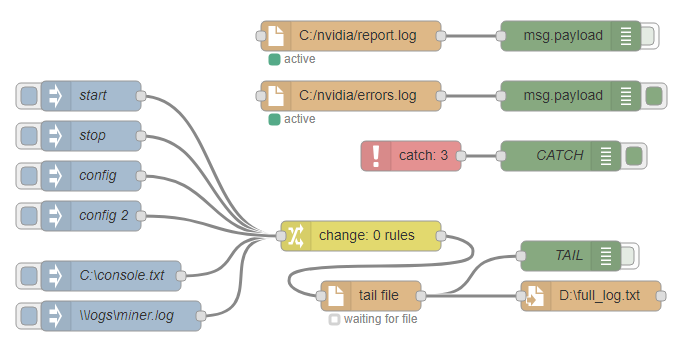

# node-red-contrib-tail-file

Node-RED Node: Tail for file **beta**

Developed for Windows, but should work on other systems too.

Feedbacks are welcome.

## Installation

From Node-RED:
```
Menu - Manage palette - Install - type "node-red-contrib-tail-file"
```
Install with npm:
```
(Linux) cd cd ~/.node-red
(Windows) cd c:\Users\<USER>\.node-red\
npm install node-red-contrib-tail-file
```

## Dependencies

[paulmillr/**chokidar**](https://github.com/paulmillr/chokidar) (tested on v2.0.4)

[jprichardson/**node-fs-extra**](https://github.com/jprichardson/node-fs-extra)

## Options

**Mode: Rewritable file**

Use this for files which are fully rewritable each time. With parameter `lineBytes` (default: 512) node will remember last 512 bytes of current file and try to find them in new file. You can limit size with options `limitSize` and `maxBytes` ("Maximum in one read" option).

If you got many errors try to increase `interval` ("Interval" option). This is equivalent of chowkidar's parameter `stabilityThreshold`.

From **chokidar** description:
> By default, the add event will fire when a file first appears on disk, before the entire file has been written. Furthermore, in some cases some change events will be emitted while the file is being written. In some cases, especially when watching for large files there will be a need to wait for the write operation to finish before responding to a file creation or modification. Setting awaitWriteFinish to true (or a truthy value) will poll file size, holding its add and change events until the size does not change for a configurable amount of time. The appropriate duration setting is heavily dependent on the OS and hardware. For accurate detection this parameter should be relatively high, making file watching much less responsive. Use with caution.

**chokidar** Perfomance options can be found here:
https://github.com/paulmillr/chokidar#performance


## Usage

**Inject**

You can send commands to `tail-file` in runtime.
For example, create `tail-file` node, then inject necessary parameters (in json format) with `inject` node.



**stop** tail:
```json
{
    "topic": "tail-file-stop"
}
```

**start** tail:
```json
{
    "topic": "tail-file-start"
}
```

**change** filename:
```json
{
    "topic": "tail-file-filename",
    "payload": "c:/new_file.log"
}
```

full **config** parameters (default):
```json
{
    "topic": "tail-file-config",
    "payload": {
        "filename": "",
        "createFile": false,
        "mode": "",
        "encoding": "utf-8",
        "split": true,
        "separator": "[\r]{0,1}\n",
        "fromBeginning": false,
        "flushAtEOF": false,
        "rememberLast": true,
        "lineBytes": 512,
        "limitSize": true,
        "maxBytes": 5120,
        "skipBlank": true,
        "useTrim": true,
        "sendError": false,
        "interval": 100,
        
        "chokidar": {
            "persistent": true,
            "ignoreInitial": true,
            "usePolling": true,
            "interval": 100,
            "binaryInterval": 300,
            "alwaysStat": true,
            "awaitWriteFinish": {
                "stabilityThreshold": 200,
                "pollInterval": 100
            },
            "ignorePermissionErrors": true,
            "atomic": true
        }
    }
}
```

"Rewritable file" **mode**:
```json
{
    "topic": "tail-file-config",
    "payload": {
        "filename": "",
        "mode": "replaced",
        "split": false,
        "fromBeginning": false,
        "rememberLast": true,
        "lineBytes": 512,
        "limitSize": true,
        "maxBytes": 5120,
        "skipBlank": false,
        "useTrim": false,
        "interval": 200
    }
}
```

example of changing **chokidar** parameters only:
```json
{
    "topic": "tail-file-config",
    "payload": {
        "chokidar": {
            "usePolling": true,
            "awaitWriteFinish": {
                "stabilityThreshold": 350
            },
            "ignorePermissionErrors": true
        }
    }
}
```

**reset** / **revert** all parameters to default:
```json
{
    "topic": "tail-file-config",
    "payload": {}
}
```
